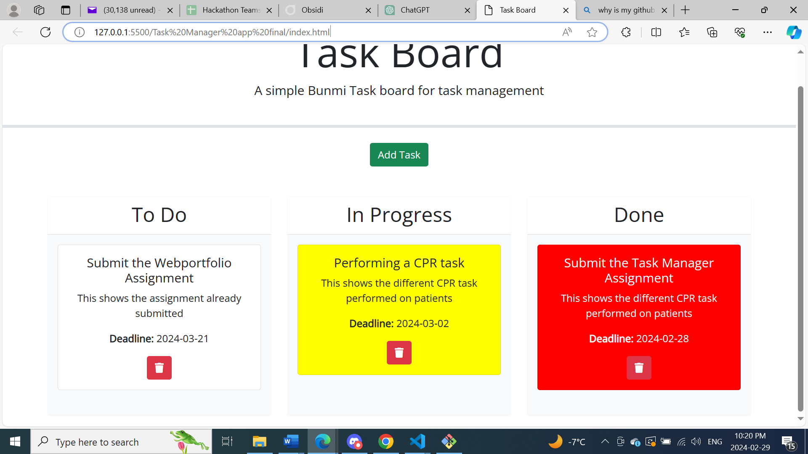

# Kanban Task Board

Kanban Task Board is a simple Kanban board for task management, allowing users to add, drag, and drop tasks between different states (To Do, In Progress, Done).

## Features

- **Task Management**: Easily add, move, and organize tasks into different stages of completion.
- **Drag-and-Drop**: Intuitive drag-and-drop functionality for seamless task management.
- **Responsive Design**: Compatible with various screen sizes and devices for optimal user experience.
- **Modal Form**: Convenient modal form for adding new tasks with title, description, and deadline fields.
- **Task Color Coding**: Tasks change color based on their state (In Progress: Yellow, Done: Red To Do: White).


## Technologies Used

- HTML5
- CSS3 (Bootstrap 5)
- JavaScript (jQuery, jQuery UI)
- [Day.js](https://github.com/iamkun/dayjs) - A minimalist JavaScript library for parsing, validating, manipulating, and displaying dates and times.

## Usage

1. Clone the repository:

   ```
   git clone https://github.com/your-username/task-board.git
   ```

2. Open the `index.html` file in your web browser.

3. Use the "Add Task" button to add new tasks with title, description, and deadline.

4. Drag and drop tasks between the "To Do", "In Progress", and "Done" columns to manage their state.

## Credits

- Task Board is inspired by the concept of Kanban boards for task management.
- The project utilizes the following libraries:
  - Bootstrap 5 for styling and layout.
  - jQuery for DOM manipulation and event handling.
  - jQuery UI for draggable and droppable interactions.
  - Day.js for handling dates and times.

## License

This project is licensed under the MIT License - see the [LICENSE](LICENSE) file for details.

